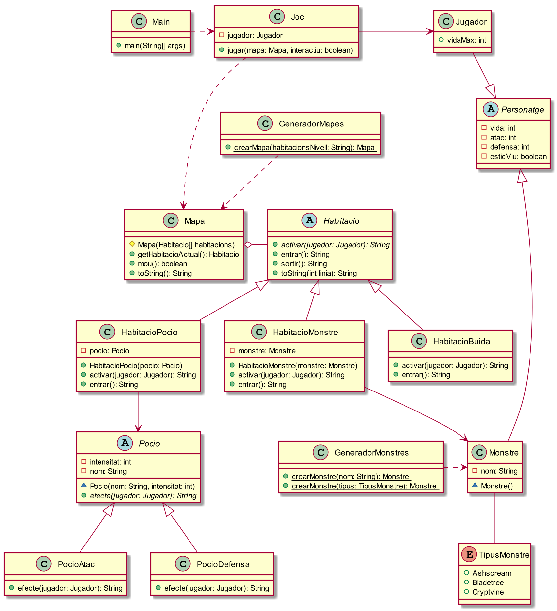

# Projecte M03-UF4 → Dungeon Tower
1. Descripció general del problema

Estem interessats en implementar una primera versió per un joc a mode de prova de concepte. La descripció general és la següent:

    El jugador recorre una sèrie d’habitacions ordenadament, començant per la primera, a l’esquerra i acabant per la última.

    El pas per les habitacions dispara diferents efectes i situacions que poden modificar els atributs del Jugador.

    L’objectiu del joc és sortir de la última habitació sense haver perdut tots els punts de vida.

2. Requisits

És important que la implementació sigui ampliable fàcilment. Els requeriments són els següents:

    El Joc no és interactiu, un cop determinat l’estat del Jugador i del mapa no necessita la intervenció d’un usuari per a funcionar. Exceptuant el prémer Enter per a passar d’una habitació a la següent.

    Els mapes poden tenir diferent nombre d’habitacions, el nombre d’habitacions d’un mapa no està restringit.

    L’aplicació s’ha de poder ampliar amb facilitat, minimitzant el tocar codi ja existent.

    Els diferents Mapes s’han de poder crear a partir de cadenes ja que la idea en un futur és crear-los a partir de fitxers de text.

